# MultiUserClaw — Plateforme SaaS multi-utilisateurs d'agents IA (Hermes Agent)

Framework léger d'assistants IA basé sur Hermes, permettant de créer rapidement une plateforme SaaS commerciale : déploiement multi-tenant isolé, connexion multi-canaux, appels d'outils, tâches planifiées et communication web en temps réel.

**Démonstration en ligne** : https://ai.infox-med.com:13080/ (inscription directe)
Backend du noyau par défaut : Hermes Agent

---

## 📌 Branches de version

- **branche main** : branche principale actuelle, basée sur la version Hermes de fin juin — Hermes étant bien plus rapide qu'OpenClaw, le projet est passé intégralement à la branche hermes
- **branche openclaw** : ancienne branche principale (archivée), basée sur OpenClaw 2026.5.10
- **branche nanobot014v3** : version nanobot 0.1.4 post v3

---

## 🎯 Principe fondamental

**Conception architecturale** : `platform` sert de passerelle de contrôle des conteneurs ; chaque utilisateur dispose de son propre conteneur géré individuellement.

```
Frontend (interface web) → Platform (passerelle plateforme) → Hermes Agent (moteur IA)
```

- **Frontend** : pages d'affichage qui dialoguent avec platform
- **Platform** : gestion/contrôle des conteneurs, délègue les interactions IA au hermes agent
- **Hermes Agent** : runtime d'agent IA basé sur Hermes

**Mise à jour de Hermes** : il suffit de reconstruire l'image hermes.

---

## 📝 Dernières évolutions

La branche main est passée intégralement à Hermes Agent : par rapport à l'ancien OpenClaw, Hermes offre un démarrage plus rapide et de meilleures performances de réponse.

---

## 📖 Sommaire

1. [Fonctionnalités](#-fonctionnalités)
2. [Aperçu de l'interface](#️-aperçu-de-linterface)
3. [Vue d'ensemble du fonctionnement](#-vue-densemble-du-fonctionnement)
4. [Déploiement multi-tenant (Docker Compose)](#2-déploiement-multi-tenant-docker-compose)
5. [Architecture globale](#4-architecture-globale)
6. [Composants clés](#5-composants-clés)
7. [Conception sécurité](#6-conception-sécurité)
8. [Frontend](#7-frontend)
9. [deploy_copy — agents et compétences préconfigurés](#8-deploy_copy--agents-et-compétences-préconfigurés)
10. [Index des fichiers](#-index-des-fichiers)
11. [Exemples d'appel API](#-exemples-dappel-api)
12. [Mettre à jour Hermes](#️-mettre-à-jour-hermes)
13. [Mappage des ports des conteneurs](#-mappage-des-ports-des-conteneurs)
14. [Configuration des canaux](#-configuration-des-canaux)
15. [Suggestions d'amélioration](#-suggestions-damélioration)
16. [Documents associés](#-documents-associés)
17. [Contact](#-contact)

---

## ✨ Fonctionnalités

Plateforme multi-tenant riche offrant les fonctions suivantes :

### 🤖 Gestion des agents IA
- Créer, configurer et gérer plusieurs agents
- Contexte de conversation indépendant pour chaque agent
- Identité de l'agent (nom, icône Emoji)
- Consultation des détails et suppression

### 💬 Conversation intelligente
- Communication temps réel WebSocket
- Rendu Markdown (coloration syntaxique du code)
- Autocomplétion des commandes slash
- Gestion multi-sessions
- Saisie vocale
- Envoi de fichiers/images

### ⏰ Tâches planifiées (Cron Jobs)
- Exécution à intervalle fixe
- Planification par expression Cron
- Exécution unique différée
- Activation/désactivation des tâches
- Exécution manuelle immédiate
- Notification des résultats (envoi vers un canal en option)

### 📚 Base de connaissances
- Répertoire de connaissances indépendant par agent
- Téléversement de documents, PDF, images, fichiers de données
- Création et gestion de dossiers
- Aperçu des fichiers (texte, code, JSON…)
- Téléchargement et suppression

### ⚡ Boutique de compétences (Skills)
- Recherche et installation de compétences IA depuis skills.sh
- Activation/désactivation des compétences
- Compétences intégrées + compétences personnalisées

### 🔌 Support multi-canaux
- Telegram
- Discord
- Email (SMTP)
- WhatsApp Web
- Signal
- Slack
- iMessage
- Et d'autres canaux extensibles
- Documentation de configuration : https://my.feishu.cn/wiki/KfTlwurh7ix0PHkQmHic2L0Snue

### 🔑 Accès API
- Génération et gestion de tokens API
- Appel des agents en ligne de commande
- Réutilisation des sessions
- Intégration de systèmes externes

### 🧠 Support multi-modèles

| Fournisseur | Exemples de modèles |
|-------------|--------------------|
| DashScope | qwen3-coder-plus, qwen-turbo |
| Anthropic | claude-sonnet-4-5, claude-opus-4-5 |
| OpenAI | gpt-4o, gpt-4o-mini, o3-mini |
| DeepSeek | deepseek-chat, deepseek-reasoner |
| AiHubMix | aihubmix/<modèle> |
| Evolink | evolink/gpt-5.2, evolink/deepseek-chat |
| OpenRouter | openrouter/<tout modèle> (solution de repli) |

### 📊 Tableau de bord
- Nombre total d'agents
- Nombre total de sessions
- Nombre total de compétences
- Vue d'état des agents

### 📁 Gestion des fichiers
- Navigation dans les fichiers de l'espace de travail
- Téléversement/téléchargement
- Création/suppression de répertoires

### ⚙️ Administration système
- Gestion des utilisateurs
- Configuration des canaux
- Configuration des modèles IA
- Journal d'audit
- Paramètres système

### 🏢 Isolation multi-tenant
- Un conteneur Docker dédié par utilisateur
- Isolation des ressources au niveau conteneur (2 Go RAM, 4 CPU)
- Création à la demande, mise en pause automatique si inactif
- Données totalement isolées

---

## 🖼️ Aperçu de l'interface

### Tableau de bord et messagerie

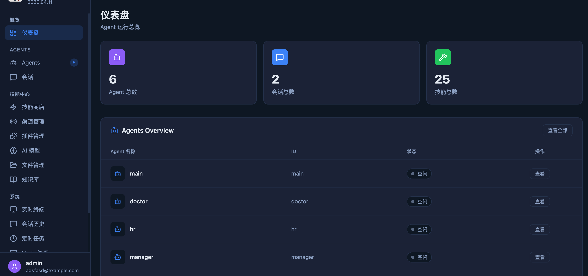
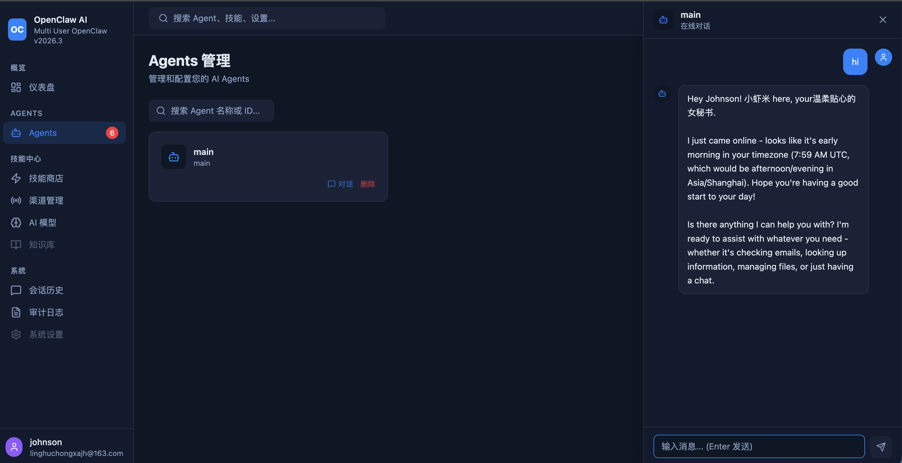
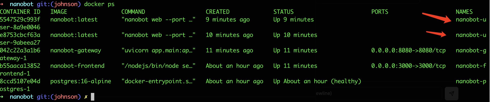

### Gestion des compétences

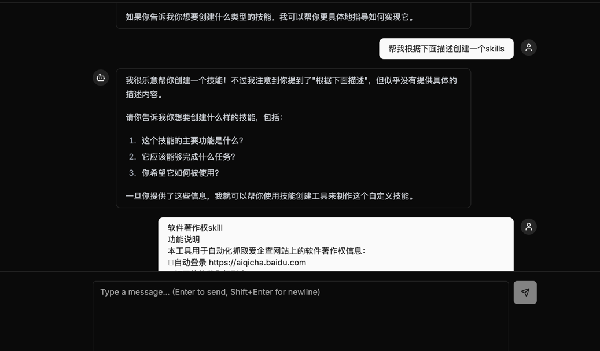
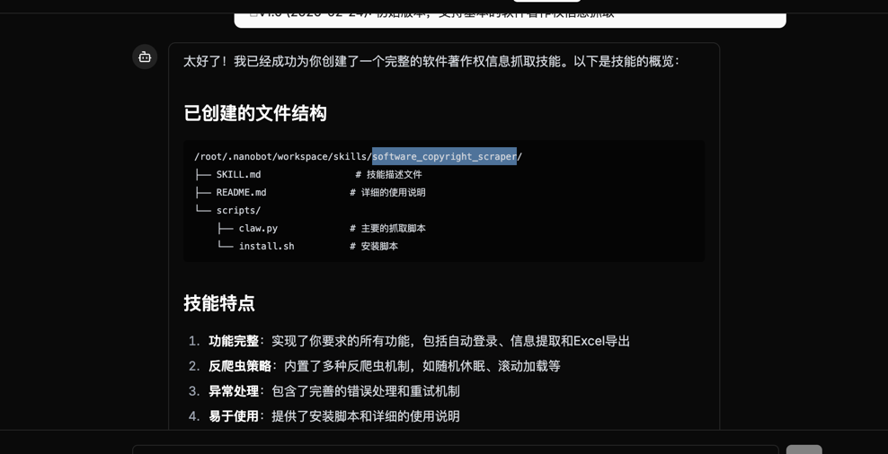
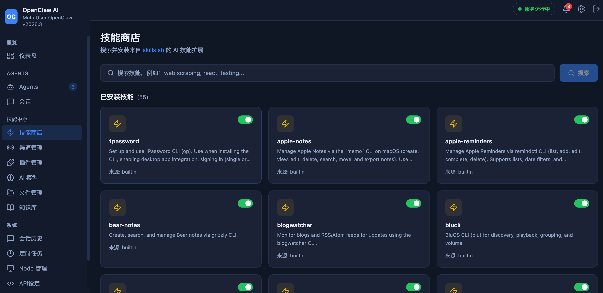

### Messagerie et administration


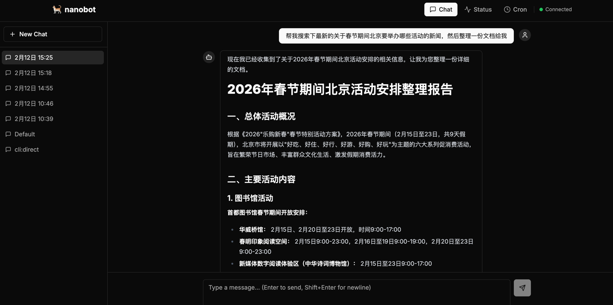
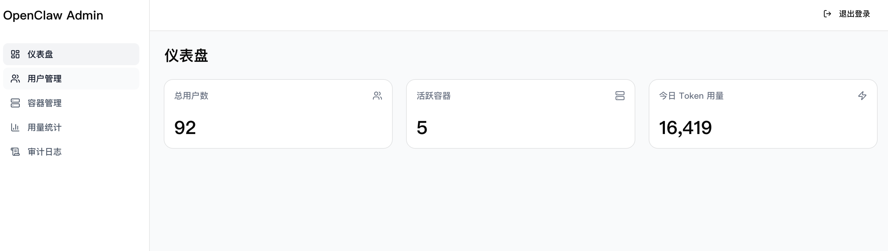

### Réparation des conteneurs

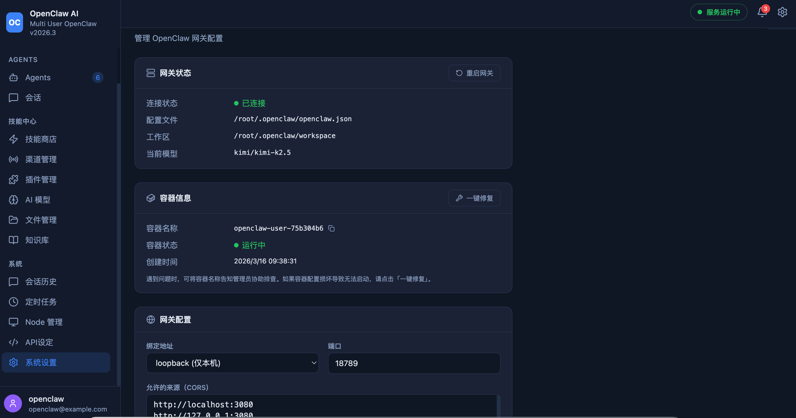

### Tâches planifiées

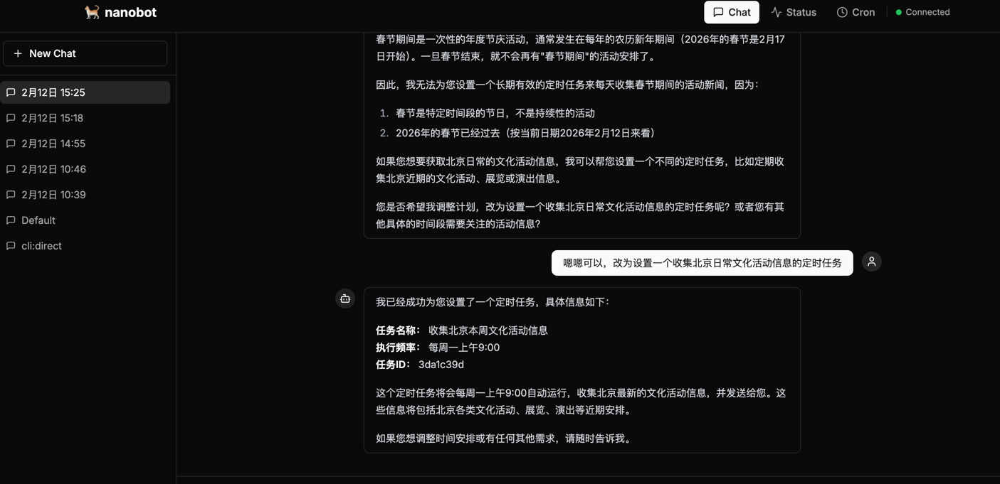
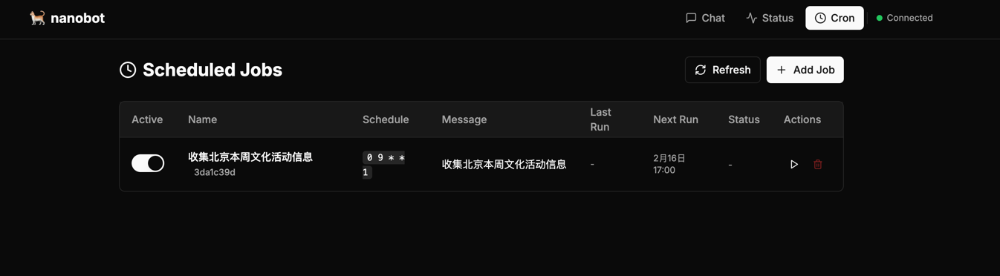

### Gestion des agents

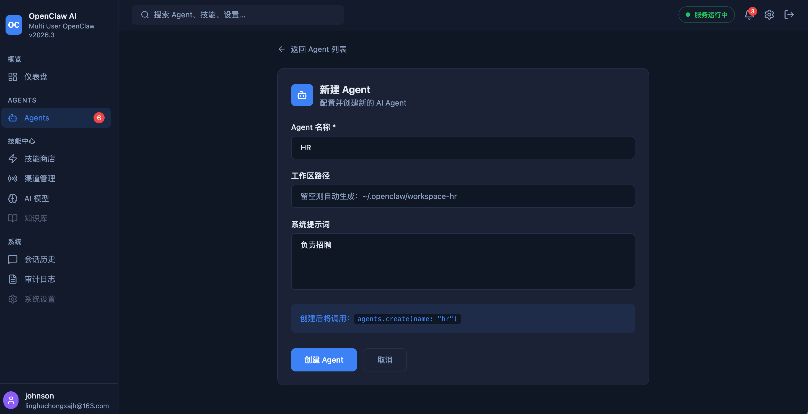

### Boutique de compétences

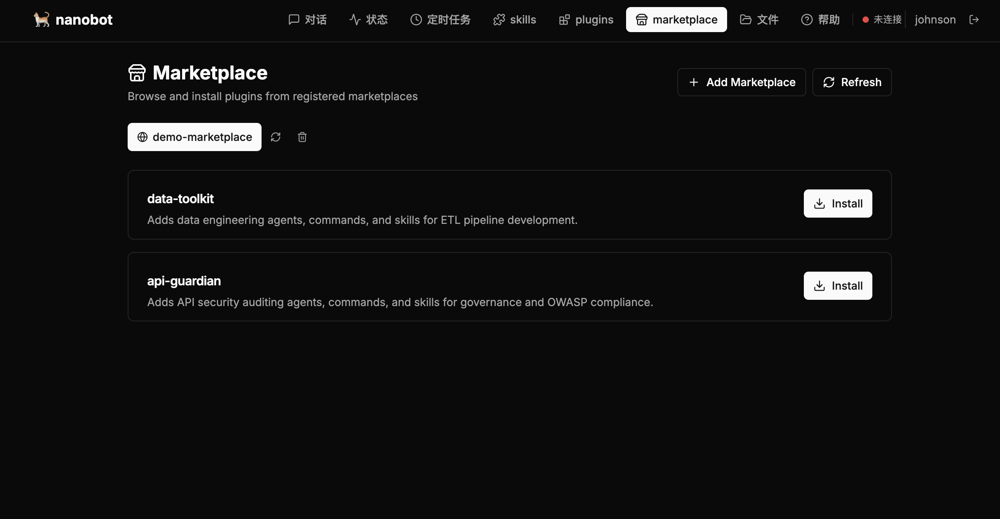

### Gestion des plugins

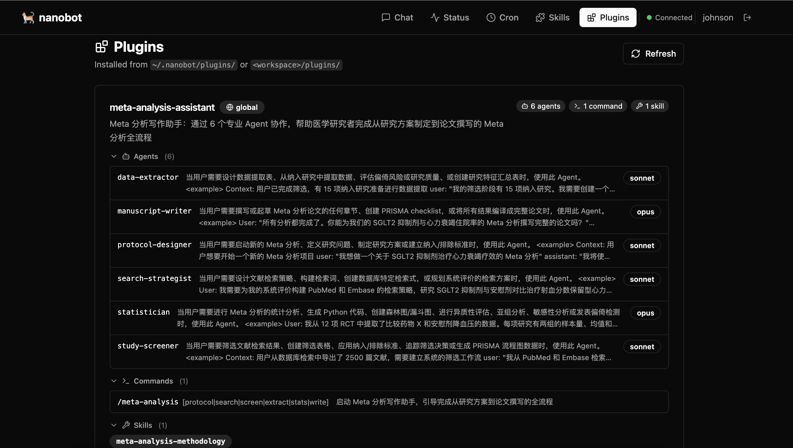

### Accès navigateur

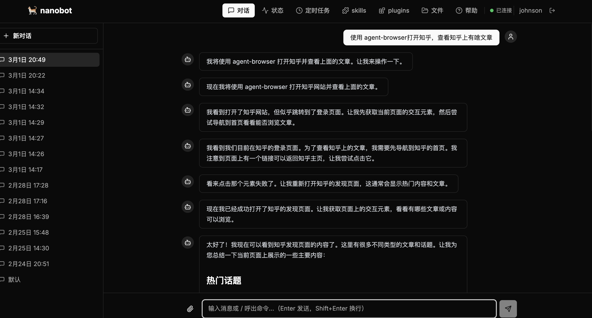
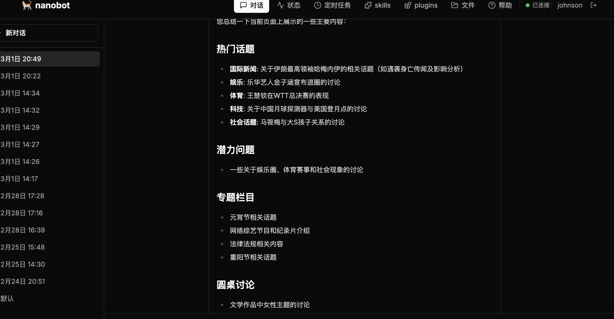

### Console d'administration

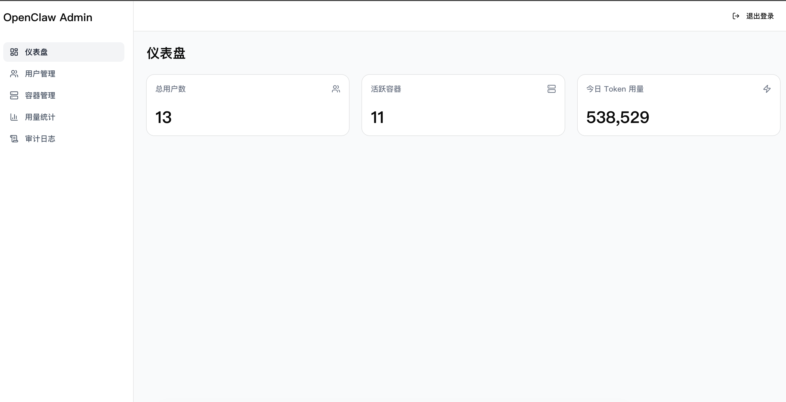

### Exemples d'appel API

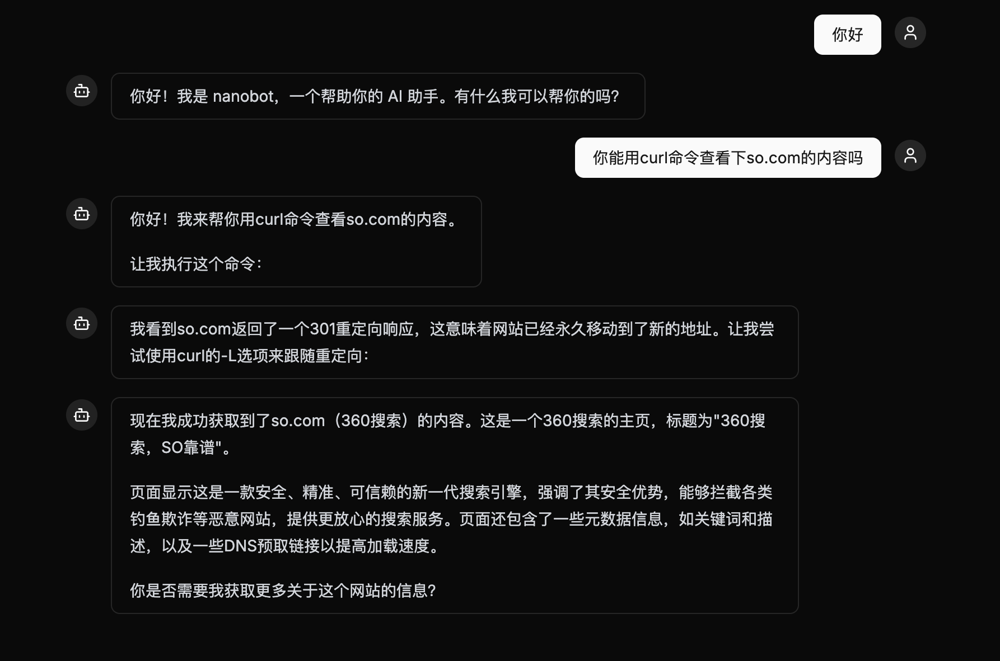
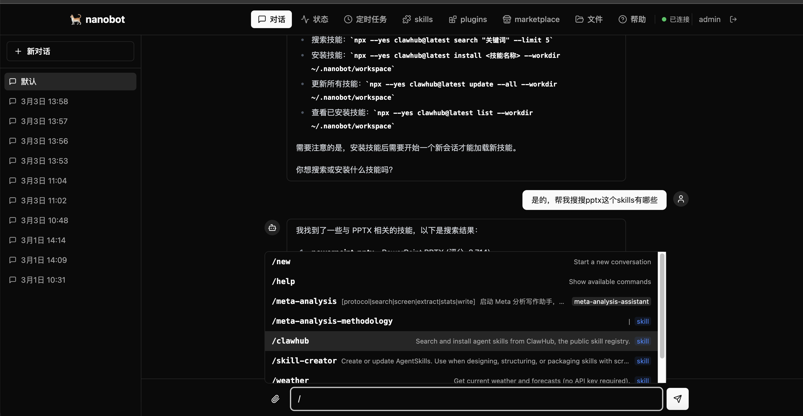

### Support vLLM

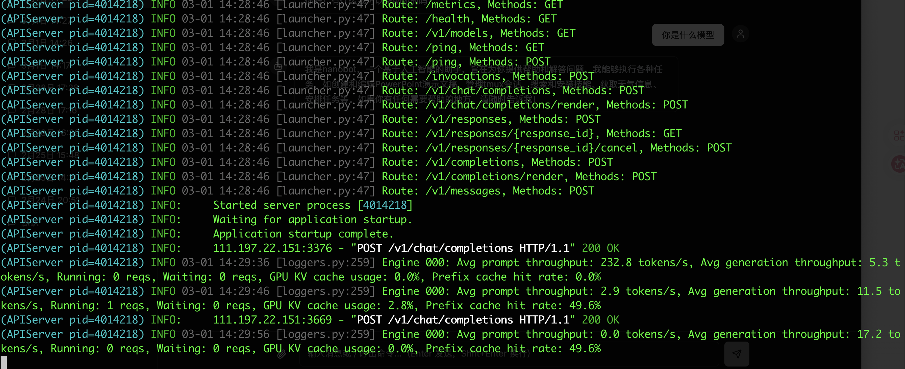

---

## 🔄 Vue d'ensemble du fonctionnement

Idée centrale du projet : **utiliser Hermes comme runtime d'agent IA de chaque utilisateur**, intégré à l'organisation multi-tenant de la plateforme grâce à la conteneurisation.

### Le voyage complet d'un message

```
L'utilisateur saisit un message dans son navigateur
    |
    v
[Frontend] Vite+React (port 3080)
    | connexion WebSocket
    v
[Platform Gateway] FastAPI (port 8080) — dossier/projet ./platform
    | 1. authentification JWT
    | 2. recherche/démarrage du conteneur utilisateur
    | 3. proxy WebSocket
    v
[Conteneur utilisateur] — un conteneur Docker dédié par utilisateur « dedicated »
    |
    |  structure interne du conteneur :
    |  ┌─────────────────────────────────────────┐
    |  │  Hermes API Server (port 18080)         │
    |  │    - API HTTP / SSE                     │
    |  │    - gestion Session / Run              │
    |  │    - appels d'outils (bash/fichiers/recherche…) │
    |  │    - système de Skills                  │
    |  └─────────────────────────────────────────┘
    |
    | quand l'agent doit appeler un LLM :
    v
[Platform Gateway] /llm/v1/chat/completions
    | 1. validation du token du conteneur
    | 2. vérification du quota utilisateur
    | 3. correspondance du fournisseur selon le nom de modèle
    | 4. injection de la vraie clé API
    v
[Fournisseurs LLM] (Anthropic / OpenAI / DashScope / DeepSeek / …)
    |
    | la réponse revient par le même chemin
    v
L'utilisateur voit la réponse dans son navigateur
```

### Parcours de la couche de compatibilité API

```
1. Frontend
   - tourne sur le port 3080
   - Vite proxifie /api vers http://localhost:8080 (gateway)

2. Gateway / Platform (backend plateforme)
   - tourne sur le port 8080, construit depuis ./platform
   - traite l'authentification, la gestion des utilisateurs, la base de données
   - pour les chemins /api/openclaw/* et /api/shared-openclaw/*, appelle le backend runtime
     via platform/app/api_compat/openclaw_compat.py

3. Hermes Runtime (conteneur utilisateur ou runtime partagé)
   - les utilisateurs dedicated ont un conteneur Docker dédié ; les utilisateurs shared partagent
     un runtime commun avec vérification de l'appartenance des sessions/runs par la plateforme
   - l'API Hermes écoute sur 18080 (dedicated) ou 8080 (shared)
   - fournit les capacités runtime : sessions, runs, skills, workspace…
```

### 1.2 Décisions de conception clés

| Décision | Détail |
|----------|--------|
| **Hermes comme noyau d'agent par défaut** | les runtimes dedicated/shared utilisent par défaut le conteneur Hermes Agent ; le backend OpenClaw reste disponible comme repli explicite |
| **Couche de compatibilité OpenClaw API** | les chemins `/api/openclaw/*` et `/api/shared-openclaw/*` sont conservés ; le sélecteur de backend runtime répartit en sous-main |
| **Les clés API n'entrent pas dans les conteneurs** | toutes les clés API LLM résident uniquement dans les variables d'environnement du Gateway ; les conteneurs y accèdent via un proxy à token |
| **Isolation au niveau conteneur (dedicated)** | conteneur et volumes indépendants par utilisateur dedicated, sans interférence |
| **Isolation logique (shared)** | les utilisateurs shared partagent le runtime ; isolation par préfixe agent/session/workspace et journalisation de l'appartenance des runs pour empêcher la lecture inter-utilisateurs |
| **Création à la demande** | le conteneur n'est créé qu'au premier message ; pause après 30 min d'inactivité, archivage après 30 jours |

---

## 2. Déploiement multi-tenant (Docker Compose)

### 2.1 Architecture

```
navigateur --> frontend:3080 --(requêtes JS)--> gateway(platform):8080 --> conteneurs utilisateurs (hermes)
                                             |                        |
                                        postgres:5432          gateway/llm/v1
                                       (utilisateurs/quota)    (injection clé API)
                                                                     |
                                                        fournisseurs LLM réels
```

- **Frontend** : interface web Vite + React — inscription, connexion, messagerie
- **Gateway** : passerelle plateforme (Python FastAPI) — authentification, gestion des conteneurs utilisateurs, proxy LLM, contrôle des quotas
- **Conteneurs utilisateurs** : une instance Hermes dédiée par utilisateur, créée automatiquement, données isolées
- **PostgreSQL** : comptes utilisateurs, métadonnées des conteneurs, historique de consommation

### 2.2 Prérequis

- Docker & Docker Compose
- Au moins une clé API d'un fournisseur LLM

### 2.3 Configuration du fichier `.env`

Créez un fichier `.env` à la racine du projet avec vos clés API et votre configuration :

```bash
# .env — lu automatiquement par docker compose

# ========== OBLIGATOIRE : au moins un fournisseur LLM ==========

# Alibaba DashScope (série Qwen)
DASHSCOPE_API_KEY=sk-xxxxxxxxxxxx

# Anthropic (série Claude)
ANTHROPIC_API_KEY=sk-ant-xxxxxxxxxxxx

# OpenAI (série GPT)
OPENAI_API_KEY=sk-xxxxxxxxxxxx

# DeepSeek
DEEPSEEK_API_KEY=sk-xxxxxxxxxxxx

# OpenRouter (routage vers tout modèle, solution de repli)
OPENROUTER_API_KEY=sk-or-xxxxxxxxxxxx

# AiHubMix
AIHUBMIX_API_KEY=sk-xxxxxxxxxxxx

# Evolink (proxy agrégateur compatible OpenAI : GPT-5 / DeepSeek / Gemini…)
EVOLINK_API_KEY=sk-xxxxxxxxxxxx

# ========== CONFIGURATION OPTIONNELLE ==========

# Modèle par défaut (utilisé pour les nouveaux conteneurs utilisateurs)
DEFAULT_MODEL=dashscope/qwen3-coder-plus

# Capacités d'entrée du proxy (conserver text,image pour la reconnaissance d'images)
# choix possibles : text ou text,image
NANOBOT_PROXY__MODEL_INPUT=text,image

# Secret JWT (impérativement modifié en production)
JWT_SECRET=votre-chaine-secrete-aleatoire
```

### 2.4 Modèles pris en charge

Après configuration des clés API correspondantes, les utilisateurs peuvent utiliser :

| Fournisseur | Exemples de modèles | Variable `.env` |
|-------------|--------------------|-----------------|
| DashScope | `dashscope/qwen3-coder-plus`, `dashscope/qwen-turbo` | `DASHSCOPE_API_KEY` |
| Anthropic | `claude-sonnet-4-5`, `claude-opus-4-5` | `ANTHROPIC_API_KEY` |
| OpenAI | `gpt-4o`, `gpt-4o-mini`, `o3-mini` | `OPENAI_API_KEY` |
| DeepSeek | `deepseek/deepseek-chat`, `deepseek/deepseek-reasoner` | `DEEPSEEK_API_KEY` |
| MiniMax | `minimax/MiniMax-M2.7`, `minimax/MiniMax-M2.7-highspeed` | `MINIMAX_API_KEY` |
| AiHubMix | `aihubmix/<modèle>` | `AIHUBMIX_API_KEY` |
| Evolink | `evolink/gpt-5.2`, `evolink/deepseek-chat` | `EVOLINK_API_KEY` |
| OpenRouter | `openrouter/<tout modèle>` (repli) | `OPENROUTER_API_KEY` |

Le Gateway associe automatiquement le fournisseur au nom du modèle et injecte la clé API correspondante ; aucun secret n'est stocké dans les conteneurs utilisateurs.
Par défaut, MiniMax route `MiniMax-M2.7` vers la variante highspeed de la même famille afin de réduire le délai de réponse ;
pour utiliser strictement le modèle d'origine, définissez `MINIMAX_M27_USE_HIGHSPEED=false`.

### 2.5 Build et démarrage

**Méthode 1 : scripts de déploiement en une commande**

```bash
# Préparer l'environnement (vérifie Docker, télécharge les images…)
python prepare.py

# === Déploiement Docker (recommandé) ===

# Déploiement Docker local (accès localhost), Python >= 3.10 recommandé
bash build_base_image.sh  # construit d'abord l'image de base ; ensuite, toute modification sous hermes
                          # se rebuild rapidement avec deploy_docker.py à partir de cette base (~1-2 min).
# build_base_image.sh produit hermes-base:latest
python deploy_docker.py --rebuild hermes
# celui-ci construit nanobot-hermes-agent:latest

# Reconstruire des services précis (Hermes est l'image runtime par défaut)
python deploy_docker.py --rebuild hermes,gateway,frontend --fast

# Par défaut l'image Hermes omet Chromium et désactive les scripts npm liés au navigateur
# pour accélérer le build ; activez explicitement si l'outil browser est nécessaire
python deploy_docker.py --rebuild hermes --with-browser
PLAYWRIGHT_DOWNLOAD_HOST=https://npmmirror.com/mirrors/playwright python deploy_docker.py --rebuild hermes --with-browser

# Les dépendances npm GitHub du pont WhatsApp sont également ignorées par défaut ; activez si besoin
HERMES_INSTALL_WHATSAPP_BRIDGE=true python deploy_docker.py --rebuild hermes

# Reconstruire un seul service
python deploy_docker.py --rebuild frontend

# Reconstruction complète après nettoyage
python deploy_docker.py --clean
```

# === Mode développement local ===

```bash
# helper de dev local (historique ; le déploiement Docker utilise Hermes par défaut)
python start_local.py

# démarrer seulement certains services
python start_local.py --only db,gateway,frontend

# tester le packaging du runtime dédié Hermes
docker build -f hermes-agent/Dockerfile.bridge -t nanobot-hermes-agent:latest hermes-agent/

# vérifier l'état des services
python check_status.py
```

> **Astuce** : changer de réseau ne nécessite pas de rebuild du frontend. Le front utilise des chemins relatifs `/api/...`, relayés par le reverse-proxy nginx — sans dépendance à l'IP.

Une fois l'environnement local démarré :

```
Environnement de développement local démarré
        PostgreSQL  http://127.0.0.1:5432  (conteneur Docker)
  Hermes Agent      http://127.0.0.1:18080  (PID xxxxx)
  Platform Gateway  http://127.0.0.1:8080
      Frontend Dev  http://127.0.0.1:3080
```

> **Variante Dokploy** : utilisez `docker-compose.dokploy.yml` (il construit aussi les images runtime) et inspirez-vous de `.env.dokploy.example`.

### 2.6 Utilisation

1. Ouvrez `http://localhost:3080`
2. Inscrivez-vous puis connectez-vous
3. Discutez — le Gateway crée automatiquement un conteneur Hermes isolé pour vous

### 2.7 Ports des services

| Service | Port | Rôle |
|---------|------|------|
| Frontend | 3080 (mappe 3000) | Interface web |
| Gateway | 8080 | Passerelle API (requêtes directes du navigateur) |
| PostgreSQL | 15432 (mappe 5432) | Base de données interne |
| Hermes Runtime (conteneur dedicated) | 18080 | HTTP + SSE exposé par le conteneur |
| Hermes Runtime (conteneur shared) | 8080 | API du runtime partagé |

### 2.8 Persistance des données

| Données | Stockage |
|---------|----------|
| Comptes, quotas, métadonnées conteneurs | PostgreSQL (volume `pgdata`) |
| Espaces de travail et sessions utilisateurs | Volumes Docker nommés + `/data/hermes-users` |

### 2.9 Commandes d'exploitation courantes

```bash
# Lister tous les conteneurs
docker ps -a --filter "name=hermes"

# Journaux d'un conteneur utilisateur
docker logs -f hermes-user-xxxxxxxx

# Reconstruire le gateway (après modification du backend)
docker compose build --no-cache gateway && docker compose up -d

# Reconstruire le frontend (après modification du front ou de l'URL API)
docker compose build --no-cache frontend && docker compose up -d

# Réinitialisation complète (supprime toutes les données)
docker compose down -v
docker rm -f $(docker ps -a --filter "name=hermes-user-" -q) 2>/dev/null
```

---

## 4. Architecture globale

```
                        ┌──────────────────────┐
                        │  Navigateur (frontend)│
                        │  Vite+React :3080     │
                        └──────────┬───────────┘
                                   │ HTTP + WebSocket
                                   v
                        ┌──────────────────────┐
                        │  Platform Gateway     │
                        │  FastAPI :8080        │
                        │  ┌────────────────┐   │
                        │  │ Auth (JWT)     │   │
                        │  │ Container Mgr  │   │
                        │  │ LLM Proxy      │   │
                        │  │ Quota Control  │   │
                        │  └────────────────┘   │
                        └───┬──────────┬───────┘
                            │          │
                  ┌─────────┘          └──────────┐
                  v                               v
        ┌──────────────┐               ┌──────────────────┐
        │  PostgreSQL   │               │ Conteneurs users │
        │  :5432        │               │ ┌──────────────┐ │
        │  comptes/     │               │ │ Bridge:18080 │ │
        │  quota/meta   │               │ │ HTTP + WS    │ │
        └──────────────┘               │ └──────┬───────┘ │
                                       │        v         │
                                       │ ┌──────────────┐ │
                                       │ │ Hermes Agent │ │
                                       │ │ :18080       │ │
                                       │ │ Agent Engine │ │
                                       │ │ Tools/Skills │ │
                                       │ │ Sessions     │ │
                                       │ └──────────────┘ │
                                       └──────────────────┘
                                                │
                                    requêtes LLM via proxy Gateway
                                                │
                                                v
                                     ┌──────────────────┐
                                     │  Fournisseurs LLM │
                                     │ Anthropic/OpenAI  │
                                     │ DashScope/...     │
                                     └──────────────────┘
```

---

## 5. Composants clés

### 5.1 Moteur Hermes Agent (`hermes-agent/`)

Hermes est un framework d'agents IA haute performance (Python) dont les capacités principales sont :

- **Agent Loop** : boucle d'appels d'outils en mode ReAct, itérations multiples
- **Système d'outils** : exécution bash, lecture/écriture de fichiers, recherche/extraction web, envoi de messages…
- **Système de Skills** : fichiers de compétences au format Markdown, intégrées + personnalisées
- **Gestion des sessions** : persistance de l'historique des conversations
- **Multi-fournisseurs** : connexion à divers LLM via une interface compatible OpenAI

### 5.2 Hermes Runtime

Le service API Hermes tourne dans chaque conteneur utilisateur :

| Composant | Responsabilité |
|-----------|---------------|
| Hermes API Server | service HTTP + SSE (port 18080), traite sessions, runs, skills… |
| Agent Engine | appels d'outils, exécution des skills, gestion des conversations |
| Workspace | opérations système de fichiers, exécution de code |

**Démarrage du conteneur :**

```
1. Lecture des variables d'environnement (URL proxy, token, nom de modèle)
2. Écriture de la configuration Hermes
3. Démarrage du Hermes API Server (0.0.0.0:18080)
4. Exposition de l'API HTTP + SSE
```

### 5.3 Platform Gateway (`platform/`)

Application Python FastAPI, centre de contrôle de toute la plateforme :

| Module | Fichier | Responsabilité |
|--------|---------|---------------|
| Authentification | `app/auth/service.py` | JWT + bcrypt, inscription/connexion/refresh |
| Gestion conteneurs | `app/container/manager.py` | création/pause/archivage/destruction via API Docker |
| Proxy LLM | `app/llm_proxy/service.py` | injection des clés API, contrôle quotas, journalisation usage |
| Proxy HTTP | `app/routes/proxy.py` | transfert HTTP/WebSocket vers les conteneurs utilisateurs |
| Base de données | `app/db/models.py` | modèles ORM : utilisateurs, conteneurs, consommation |

**Cycle de vie d'un conteneur :**

```
Premier message de l'utilisateur → create_container()
  ├─ réservation en base (anti-concurrence)
  ├─ création des volumes Docker (workspace + sessions)
  ├─ démarrage du conteneur (limites : 2 Go RAM, 4 CPU)
  └─ enregistrement IP + token du conteneur

Inactif 30 min → pause (libère le CPU)
Nouvel accès   → unpause (reprise en quelques secondes)
Inactif 30 j   → archive
Suppression user → destroy (retire le conteneur, conserve les volumes de données)
```

### 5.4 Mécanisme de proxy LLM

Quand Hermes dans le conteneur appelle un LLM, il passe par le proxy du Gateway plutôt que directement :

```
Hermes dans le conteneur
  → POST http://gateway:8080/llm/v1/chat/completions
    Authorization: Bearer <container-token>
    Body: { model: "claude-sonnet-4-5", messages: [...] }

Traitement par le Gateway :
  1. retrouver l'utilisateur via le container-token
  2. contrôler le quota quotidien de tokens (free : 100 K, basic : 1 M, pro : 10 M)
  3. associer le fournisseur selon le modèle (claude→Anthropic, gpt→OpenAI, qwen→DashScope…)
  4. injecter la vraie clé API correspondante
  5. appeler le LLM et retourner le résultat (stream ou non)
  6. journaliser la consommation de tokens
```

### 5.5 Système de Skills

Les fichiers de compétences se trouvent dans `hermes-agent/skills/` ; chaque compétence est un dossier contenant un `SKILL.md`. Les utilisateurs peuvent créer leurs propres compétences dans leur espace de travail.

**Interfaces de gestion (via l'API Hermes) :**

- `GET /api/skills` — lister toutes les compétences (intégrées + personnalisées)
- `POST /api/skills/upload` — téléverser une compétence (ZIP)
- `DELETE /api/skills/:name` — supprimer une compétence personnalisée
- `GET /api/skills/:name/download` — exporter une compétence

---

## 6. Conception sécurité

| Aspect | Mesure |
|--------|--------|
| Isolation des clés API | les clés LLM n'existent que dans les variables du Gateway ; aucun secret dans les conteneurs |
| Isolation conteneurs | un conteneur Docker par utilisateur, volumes distincts, limites de ressources |
| Chaîne d'authentification | JWT front-end → Gateway → token conteneur (éphémère, identifie seulement le conteneur) |
| Isolation réseau | les conteneurs utilisateurs tournent sur un réseau interne ; LLM accessible uniquement via le Gateway |
| Contrôle des quotas | quota quotidien de tokens, par niveau d'utilisateur |
| Sécurité interne | le Hermes API Server n'écoute que le port interne du conteneur, accessible via le proxy du Gateway |

---

## 7. Frontend

SPA Vite + React Router, thème sombre, située dans `frontend/`.

### 7.1 Stack technique

| Technologie | Usage |
|-------------|-------|
| Vite | outil de build |
| React + React Router | routage et framework SPA |
| Tailwind CSS | styles |
| react-markdown + remark-gfm | rendu Markdown (coloration, tableaux, bouton copier) |
| lucide-react | icônes |

### Structure des répertoires

```
frontend/
├── Dockerfile                  # image de production (npm build → nginx statique)
├── nginx.conf                  # nginx : / fichiers statiques, /api → reverse-proxy gateway
├── package.json                # dépendances
├── vite.config.ts              # config Vite (proxy dev /api → localhost:8080)
├── tailwind.config.js          # thème Tailwind
├── index.html                  # entrée SPA
└── src/
    ├── main.tsx                # point d'entrée React, monte <App />
    ├── App.tsx                 # définition des routes (React Router)
    ├── index.css               # styles globaux + @import Tailwind
    ├── lib/
    │   └── api.ts              # client API (fetch + WebSocket, chemins relatifs /api/...)
    ├── store/
    │   └── agents.ts           # requêtes agents (fetchAgents, fetchDashboardStats…)
    ├── types/
    │   └── agent.ts            # types TypeScript (BackendAgent, DashboardStats…)
    ├── components/
    │   ├── Layout.tsx          # layout global : Sidebar + TopBar + <Outlet />
    │   ├── Sidebar.tsx         # navigation latérale
    │   ├── TopBar.tsx          # barre supérieure (profil, déconnexion)
    │   └── MarkdownContent.tsx # composant de rendu Markdown (code + copier)
    └── pages/
        ├── Dashboard.tsx       # tableau de bord : cartes stats + liste des agents
        ├── Login.tsx           # connexion
        ├── Agents.tsx          # liste des agents
        ├── AgentCreate.tsx     # création d'un agent
        ├── AgentDetail.tsx     # détails (config, édition d'identité)
        ├── Chat.tsx            # messagerie : sessions + messages + WebSocket + slash commands
        ├── Sessions.tsx        # gestion des sessions
        ├── SkillStore.tsx      # boutique de compétences
        ├── CronJobs.tsx        # tâches planifiées
        ├── KnowledgeBase.tsx   # base de connaissances
        ├── FileManager.tsx     # navigation fichiers workspace
        ├── Channels.tsx        # canaux
        ├── AIModels.tsx        # modèles IA
        ├── Plugins.tsx         # plugins
        ├── Nodes.tsx           # nœuds
        ├── ApiAccess.tsx       # tokens API
        ├── AuditLog.tsx        # journal d'audit
        └── SystemSettings.tsx  # paramètres système
```

### 7.3 Routes des pages

| Route | Fichier | Fonction |
|-------|---------|----------|
| `/` | `Dashboard.tsx` | tableau de bord : stats agents/sessions/compétences + aperçu |
| `/login` | `Login.tsx` | connexion |
| `/agents` | `Agents.tsx` | liste des agents |
| `/agents/new` | `AgentCreate.tsx` | création |
| `/agents/:id` | `AgentDetail.tsx` | détails et configuration |
| `/agents/:id/chat` | `Chat.tsx` | conversation (WebSocket temps réel + Markdown) |
| `/sessions` | `Sessions.tsx` | sessions |
| `/skills` | `SkillStore.tsx` | boutique de compétences |
| `/cron` | `CronJobs.tsx` | tâches planifiées |
| `/knowledge` | `KnowledgeBase.tsx` | base de connaissances |
| `/files` | `FileManager.tsx` | fichiers |
| `/channels` | `Channels.tsx` | canaux |
| `/models` | `AIModels.tsx` | modèles |
| `/plugins` | `Plugins.tsx` | plugins |
| `/api-access` | `ApiAccess.tsx` | tokens API |
| `/audit` | `AuditLog.tsx` | journal d'audit |
| `/settings` | `SystemSettings.tsx` | paramètres système |

### 7.4 Requêtes réseau

- **Production** : nginx relaie `/api/*` vers le conteneur gateway — aucune IP codée en dur
- **Développement** : Vite proxifie `/api/*` vers `http://localhost:8080`
- **Changement de réseau sans rebuild** : chemins relatifs gérés par le reverse-proxy

### 7.5 Protocole WebSocket

**Frontend → Gateway → Hermes Agent** (proxy couche par couche)

```json
// envoyer un message
{ "type": "req", "id": 1, "method": "chat.send", "params": { "sessionKey": "...", "message": "..." } }

// recevoir une réponse (événement poussé)
{ "type": "event", "event": "chat.message.received", "payload": { "content": "..." } }

// heartbeat
{ "type": "ping" } / { "type": "pong" }
```

---

## 8. deploy_copy — agents et compétences préconfigurés

### 8.1 Structure

```
deploy_copy/
├── hermes_defaults.json                # configuration par défaut Hermes
├── Agents/                             # espaces de travail préconfigurés
│   ├── hr/                             # conseiller RH
│   │   ├── SOUL.md                     # personnalité et principes
│   │   ├── AGENTS.md                   # règles comportementales et outils
│   │   └── USER.md                     # profil utilisateur et préférences
│   ├── researcher/                     # chercheur senior
│   │   ├── SOUL.md
│   │   ├── AGENTS.md
│   │   └── USER.md
│   └── programmer/                     # développeur full-stack
│       ├── SOUL.md
│       ├── AGENTS.md
│       └── USER.md
```

### Fonctionnement

deploy_copy est un **répertoire de modèles de déploiement** : au démarrage, les agents et compétences préconfigurés sont synchronisés vers le répertoire d'exécution Hermes.

**Flux de synchronisation (idempotent, copie uniquement les fichiers absents) :**

```
deploy_copy/Agents/hr/             → espace de travail Hermes Agent
                                     répertoire d'enregistrement de l'agent
                                     enregistrement dans le fichier de configuration

deploy_copy/hermes_defaults.json   → fusion dans la config Hermes (uniquement les clés manquantes)
```

**Implémentation selon le mode de déploiement :**

| Mode | Implémentation | Moment |
|------|---------------|--------|
| `start_local.py` | `_sync_agents()` + `_sync_dir()` | au lancement du script Python, sur le système de fichiers local |
| `deploy_docker.py` | entrypoint du conteneur | au démarrage du conteneur, depuis `/deploy-copy/` vers le répertoire Hermes |

**Étapes clés de l'enregistrement d'un agent :**

1. **Créer le répertoire de l'agent** — Hermes découvre les agents en scannant ce répertoire
2. **Synchroniser l'espace de travail** — y placer SOUL.md, AGENTS.md, etc.
3. **Écrire la configuration** — ajouter les informations de l'agent au fichier de configuration (source de la liste renvoyée par l'API)

> Si seule l'étape 2 est faite, l'agent n'apparaît pas dans l'interface : les trois étapes sont indispensables.

### Ajouter un nouvel agent préconfiguré

```bash
# 1. créer le répertoire
mkdir -p deploy_copy/Agents/my_agent

# 2. rédiger les fichiers Markdown
# SOUL.md   — identité, personnalité, principes fondamentaux de l'agent
# AGENTS.md — règles comportementales, guide des outils, format de sortie
# USER.md   — profil des utilisateurs cibles, préférences d'interaction

# 3. redéployer
python deploy_docker.py --host localhost        # mode Docker
# ou
python start_local.py                           # mode local (synchro automatique)
```

L'agent apparaît ensuite sur `http://localhost:3080/agents`.

---

## 📂 Index des fichiers

### Racine du projet

```
racine/
├── .env                            # clés API (non commité)
├── .env.example                    # modèle de variables d'environnement
├── docker-compose.yml              # orchestration multi-tenant (postgres + gateway + frontend)
├── docker-compose.dokploy.yml      # variante prête pour Dokploy (build des images runtime inclus)
├── .env.dokploy.example            # variables d'environnement pour Dokploy
├── deploy_docker.py                # script de déploiement Docker (local/distant/rebuild/nettoyage)
├── start_local.py                  # lancement local (tous services)
├── prepare.py                      # préparation environnement (vérifie Docker, tire les images)
├── check_status.py                 # état des services
├── call_agent_api.py               # exemple d'appel API
├── inspect_db.py                   # inspection base de données
├── pyproject.toml                  # configuration Python
│
├── deploy_copy/                    # modèles de déploiement (copiés dans les conteneurs)
│   ├── hermes_defaults.json        # config par défaut Hermes
│   └── Agents/                     # agents préconfigurés (hr, researcher, programmer…)
│
├── hermes-agent/                   # moteur Hermes Agent
├── platform/                       # passerelle multi-tenant (FastAPI)
├── frontend/                       # frontend web (Vite + React)
├── doc/                            # documentation et captures d'écran
└── ssh_key/                        # clés SSH (déploiement distant)
```

### Hermes Agent (`hermes-agent/`)

Moteur d'agent IA par défaut du projet ; tourne dans chaque conteneur utilisateur.

```
hermes-agent/
├── Dockerfile                      # image de base Hermes
├── Dockerfile.bridge               # image runtime Hermes
├── entrypoint.sh                   # point d'entrée du conteneur
├── pyproject.toml                  # dépendances Python
│
└── src/                            # code source Hermes
    ├── server.py                   # serveur API HTTP + SSE (port 18080)
    ├── agent/                      # moteur : appels d'outils, exécution des skills
    ├── routes/                     # routes REST
    │   ├── agents.py               # gestion des agents : liste, détails, création, suppression
    │   ├── sessions.py             # sessions : liste, historique, création, suppression
    │   ├── skills.py               # compétences : liste, upload, suppression, export
    │   ├── cron.py                 # tâches planifiées : création, suppression, activation
    │   ├── channels.py             # gestion des canaux
    │   ├── files.py                # fichiers : upload, download
    │   └── marketplaces.py         # marché de skills : recherche/install depuis skills.sh
```

### Passerelle multi-tenant (`platform/`)

Application Python FastAPI, centre de contrôle de la plateforme.

```
platform/
├── Dockerfile                      # image gateway (Python + uvicorn)
├── pyproject.toml                  # dépendances (fastapi, sqlalchemy, docker, jose…)
├── alembic.ini                     # migrations base de données
├── README.md                       # documentation Platform
│
├── alembic/                        # scripts de migration
│   ├── env.py                      # configuration Alembic
│   └── script.py.mako              # gabarit de migration
│
└── app/                            # application FastAPI
    ├── main.py                     # point d'entrée : app FastAPI, routes, événements
    ├── config.py                   # configuration centrale : clés API, URL BDD, quotas, modèle défaut
    ├── logging_setup.py            # configuration des journaux
    │
    ├── auth/                       # module d'authentification
    │   ├── service.py              # JWT + bcrypt (inscription/connexion/refresh)
    │   └── dependencies.py         # injection de dépendances (get_current_user…)
    │
    ├── container/                  # gestion des conteneurs
    │   └── manager.py              # encapsulation API Docker : create/pause/resume/archive/destroy
    │
    ├── db/                         # module base de données
    │   ├── engine.py               # moteur SQLAlchemy async + fabrique de sessions
    │   └── models.py               # ORM : User, Container, Usage
    │
    ├── llm_proxy/                  # proxy LLM
    │   └── service.py              # injection clés, matching fournisseur, quotas, usage
    │
    └── routes/                     # routes API
        ├── auth.py                 # POST /auth/register, /auth/login, /auth/refresh
        ├── proxy.py                # /api/* → conteneur utilisateur (HTTP + WebSocket)
        ├── llm.py                  # POST /llm/v1/chat/completions (entrée LLM des conteneurs)
        └── admin.py                # admin : liste utilisateurs, conteneurs, état système
```

### Frontend (`frontend/`)

Voir la section [Frontend](#7-frontend).

---

## 🔌 Exemples d'appel API

Le script `call_agent_api.py` permet d'appeler un agent en ligne de commande, pratique pour intégrer des systèmes externes.

```bash
# Avec un token API (généré depuis la page Système → API du front-end)
python call_agent_api.py --api-token "eyJ..." --agent main --message "Bonjour"

# Spécifier l'ID de l'agent
python call_agent_api.py --api-token "eyJ..." --agent insurance --message "Analyse ma proposition d'assurance"

# Réutiliser une session existante
python call_agent_api.py --api-token "eyJ..." --agent main --message "Continue" --session "agent:main:session-123"

# Avec identifiants (déconseillé)
python call_agent_api.py --username admin --password admin123 --agent main --message "Bonjour"

# Spécifier l'adresse du serveur
python call_agent_api.py --base-url http://192.168.1.100:8080 --api-token "eyJ..." --agent main --message "hello"
```

---

## ⬆️ Mettre à jour Hermes

### Reconstruire l'image Hermes

```bash
# reconstruction de l'image Hermes
python deploy_docker.py --rebuild hermes

# avec support navigateur
python deploy_docker.py --rebuild hermes --with-browser
```

### Commandes d'exploitation utiles

- **Lister tous les volumes** — `docker volume ls`
- **Supprimer les données montées d'un utilisateur** — `docker volume rm xxx`

---

## 🔌 Mappage des ports des conteneurs

### Exposition des ports navigateur et service

Les ports internes 5900 (navigateur) et 30000 (service externe) des conteneurs sont mappés vers des ports aléatoires de l'hôte.

```python
browser_binding = _published_binding(docker_container, "5900/tcp")
service_binding = _published_binding(docker_container, "30000/tcp")
```

---

## 🔗 Configuration des canaux

Pour configurer les canaux (QQ, Feishu…) :

https://zhuanlan.zhihu.com/p/2016049817437111235

---

## 💡 Suggestions d'amélioration

### Fonctionnalités

1. Ajouter des statistiques de modèles dans la console admin
2. La suppression d'un canal fraîchement installé ne répond pas
3. Agrandir automatiquement la zone de saisie au-delà de deux lignes (jusqu'à 6-7 lignes)
4. Un nom de fichier trop long masque le bouton supprimer — impossible de supprimer
5. Les réponses trop longues sont tronquées (rédaction d'articles) — mécanisme à revoir
6. Afficher le processus de réflexion/actions, repliable — actuellement seul le résultat s'affiche

### Autres

- Sauvegarde et distribution des configurations d'agents : l'admin configure et sauvegarde les agents puis les distribue aux utilisateurs, évitant suppressions/casse accidentels
- Améliorer le terminal temps réel intégré, actuellement limité à des commandes simples

---

## 📚 Documents associés

- Configuration nginx et domaines : `doc/hermes_web.conf`
- Schéma de la base de données : `doc/table.md`
- Déploiement hors ligne : `doc/deploiement-hors-ligne.md`
- Support vLLM : `doc/vllm.md`
- Changer logo et nom : `doc/changer-logo-et-nom.md`
- Déploiement Dokploy : `docker-compose.dokploy.yml` + `.env.dokploy.example`

---

## 📬 Contact

Pour toute question, contactez l'auteur : **johnsongzc**


---

## 📄 Licence

Voir le fichier [LICENSE](LICENSE).